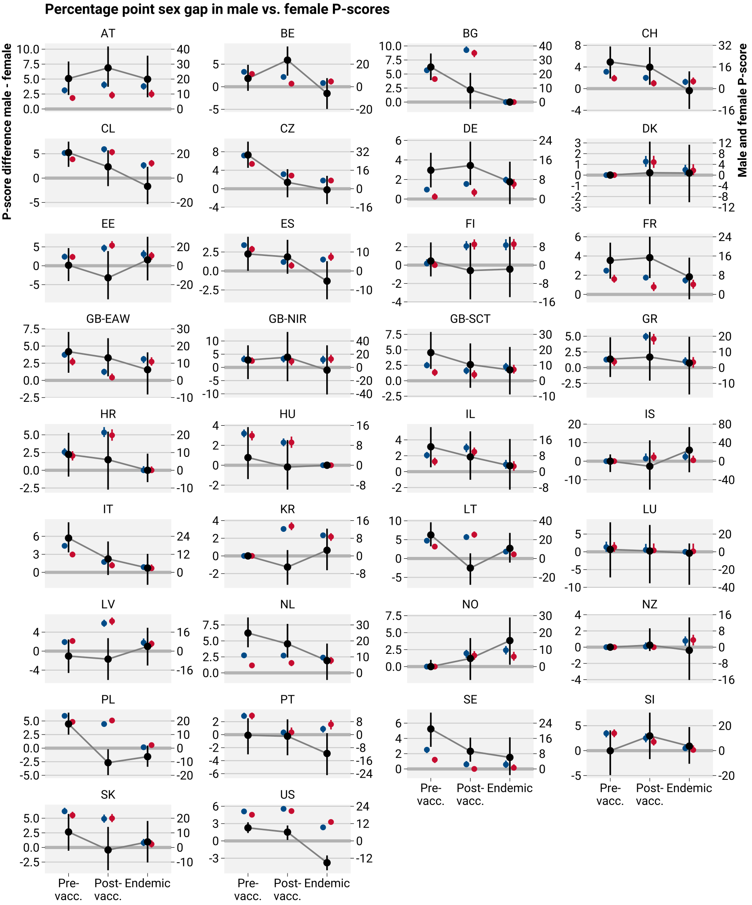

# Temporal Dynamics of Sex Differences in Excess Mortality in 2020-2023

The file `tmp/excess_deaths.rds` holds sex and age specific excess death estimates for a range of countries from 2020 through 2023. The following fields are relevant:

- `timeframe`: The time aggregation (epiyear, monthly, pandemic, pandemicperiod, weekly). If you want estimates by, e.g. pandemic period, (Pre-vac, Post-vac, Endemic), then filter the data down to `filter(excess_deaths, timeframe == 'pandemicperiod')`. This will yield a data frame with one row per country, per time period.
- `region_iso`: The country code
- `age_group`: The age group. Note that there is also an age group "Total".
- `timeframe_value`: The time interval as a factor.
- `iso_year`: Year at the start of the time interval.
- `iso_week`: Week at the start of the time interval.
- Excess measures: These are variables with names composed of four parts `<measure>-<cumulation>-<sex>-<quantile>`, e.g. `psc_int_m_q50` refers to the Pscore excess estimate (`psc`) over the current time interval (`int`) for males (`m`) evaluated at the median `q50`. Here's the key:
  - Measure
    - `pyr` personyears exposure
    - `obs` observed deaths
    - `xpc` expected deaths
    - `xc1` excess death count, no negatives
    - `xr1` excess death rate per person year, no negatives
    - `psc` (excess death P-score, no negatives)
  - Cumulation
    - `int` measure refers to the current time interval
    - `cum` measure refers to the time since start of pandemic through current time interval (cumulated)
  - Sex
    - `m` male
    - `f` female
    - `t` total
    - `sdf` male minus female difference
  - Quantile
    - `q025` 2.5% prediction interval
    - `q05` 5% prediction interval
    - `q25` 25% prediction interval
    - `q50` median prediction (report as central estimate)
    - `q75` 75% prediction interval
    - `q95` 95% prediction interval
    - `q975` 97.5% prediction interval
